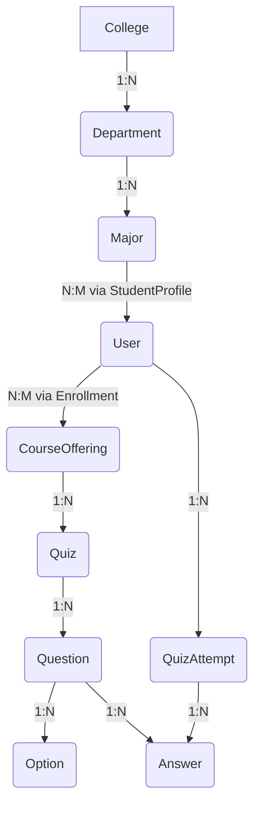

# 🧠 المخطط الأزرق الرئيسي (MASTER BLUEPRINT)

> **آخر تحديث:** 3 فبراير 2026
> **المؤلف:** MAX EVOLVED (System Architect Mode)
> **الحالة:** 🟢 نهائي ومُعتمد

---

## 🎯 الغرض

هذا المستند هو **"مصدر الحقيقة الوحيد"** لمشروع **UniCore-OS**. إذا فقدت ذاكرتك غداً، قراءة هذا الملف يجب أن تعيد لك 100% من سياق المشروع وفهمه.

---

## 📜 الفهرس

1.  [**الفلسفة الأساسية (Core Philosophy)**](#1-الفلسفة-الأساسية-core-philosophy)
2.  [**الهيكلية وقاعدة البيانات (Architecture & Database)**](#2-الهيكلية-وقاعدة-البيانات-architecture--database)
3.  [**نظام الصلاحيات الديناميكي (Dynamic RBAC)**](#3-نظام-الصلاحيات-الديناميكي-dynamic-rbac)
4.  [**التدفقات الرئيسية (Core Flows)**](#4-التدفقات-الرئيسية-core-flows)
5.  [**امتحان الضغط (Stress Test - 42 سؤال)**](#5-امتحان-الضغط-stress-test---42-سؤال)

---

## 1. الفلسفة الأساسية (Core Philosophy)

نحن لا نبني موقعاً تقليدياً، بل نظام تشغيل جامعي (University OS) يرتكز على ثلاثة مبادئ غير قابلة للتفاوض:

### 1.1. المركزية الصارمة (Strict Centralization)

-   **الأدمن هو المالك الوحيد للحقيقة:** الحسابات لا تُنشأ عشوائياً من قبل المستخدمين، بل تُمنح وتُدار مركزياً من قبل إدارة النظام.
-   **الحسابات المسبقة (Pre-provisioned):** يتم استيراد المستخدمين (طلاب، دكاترة) بشكل جماعي. لا يوجد خيار "إنشاء حساب جديد" للعامة.
-   **النتيجة:** نضمن أن كل حساب في النظام يمثل شخصاً حقيقياً وموثوقاً ضمن المؤسسة، مما يلغي الحاجة لآليات معقدة لمكافحة البريد العشوائي والحسابات الوهمية.

### 1.2. الأمان المتسامح (Forgiving Security)

-   **البيانات لا تُحذف أبداً (Soft Delete):** كل عمليات الحذف في النظام هي عمليات "إخفاء" (Soft Delete). يتم الاحتفاظ بالسجل مع وضع علامة `deletedAt` عليه. هذا يضمن إمكانية الاسترجاع الكامل للبيانات في حالة الحذف الخاطئ ويوفر سجلاً كاملاً للتدقيق.
-   **الأخطاء الجماعية تُلغى فوراً (Transactions):** أي عملية جماعية (مثل استيراد 5000 طالب) تتم داخل معاملة (Transaction). إذا فشلت العملية في أي خطوة، يتم التراجع (Rollback) عن جميع التغييرات، مما يضمن نزاهة قاعدة البيانات.

### 1.3. الذكاء المساعد (Assisted Intelligence)

-   **الذكاء الاصطناعي ليس بديلاً عن الدكتور:** محرك الذكاء الاصطناعي (AI Engine) ليس مصمماً ليحل محل الخبرة البشرية.
-   **بل "مساعد خارق":** وظيفته هي تضخيم قدرات الدكتور، ومساعدته في بناء بنوك أسئلة متنوعة واختبارات متوازنة بسرعة وكفاءة، مع ترك القرار النهائي والتحكم الكامل في يد الدكتور.

---

## 2. الهيكلية وقاعدة البيانات (Architecture & Database)

### 2.0. حزمة التكنولوجيا (Tech Stack)

- **الإطار (Framework):** Next.js 16 (App Router)
- **لغة البرمجة:** TypeScript 5.9
- **قاعدة البيانات:**
  - **التطوير (Development):** SQLite (للسرعة وسهولة الإعداد بدون Docker)
  - **الإنتاج (Production):** PostgreSQL (للقوة والموثوقية)
- **ORM:** Prisma 5
- **المصادقة (Authentication):** NextAuth v5
- **الواجهات (UI):** TailwindCSS 4 + shadcn/ui
- **التحقق (Validation):** Zod
- **إدارة الحالة (State Management):** Zustand

### 2.1. الهيكل الهرمي للكيانات الأكاديمية

العلاقة بين الكيانات الأكاديمية تتبع تسلسلاً هرمياً ومنطقياً لضمان تنظيم البيانات وسهولة الاستعلام.

| الكيان | الوصف |
| :--- | :--- |
| **College** | الكلية (مثل: كلية الهندسة). |
| **Department** | القسم الأكاديمي (مثل: قسم هندسة الحاسب). |
| **Major** | التخصص الدقيق (مثل: تخصص الذكاء الاصطناعي). |
| **User** | المستخدم (طالب، دكتور، إداري). |
| **Course** | المادة الخام في الكتالوج (مثل: CS101 - مقدمة في البرمجة). |
| **CourseOffering** | **(الأهم)** الشعبة الدراسية الحية التي تربط المادة + الدكتور + الفصل الدراسي. |
| **Enrollment** | السجل الذي يربط الطالب بالشعبة الدراسية. |
| **Quiz** | الاختبار الإلكتروني المرتبط بشعبة دراسية محددة. |

### 2.2. الكارثة: لماذا فصلنا `Course` عن `CourseOffering`؟

هذا هو القرار التصميمي الأكثر أهمية في النظام بأكمله.

-   **`Course` (المادة الخام):** هي مجرد معلومة ثابتة في كتالوج الجامعة (e.g., `CS101`, `Introduction to Programming`).
-   **`CourseOffering` (الشعبة الحية):** هي تحويل المادة إلى واقع ملموس. هي التي تربط `CS101` بـ `الدكتور فهد` في `الفصل الدراسي الأول 2026`.

**السيناريو الكارثي (بدون `CourseOffering`):**
1.  طالب "أحمد" يسجل في مادة `CS101`.
2.  في الفصل الأول، يدرسه الدكتور "فهد".
3.  في الفصل الثاني، تدرسه الدكتورة "سارة".
4.  عندما يريد "أحمد" مراجعة درجاته، ستختلط درجات كويزات "فهد" مع كويزات "سارة" تحت نفس المادة `CS101`.

**الحل بـ `CourseOffering`:**
-   `CourseOffering_1`: (CS101 + د.فهد + ترم1) -> لها كويزاتها وطلابها.
-   `CourseOffering_2`: (CS101 + د.سارة + ترم2) -> لها كويزاتها وطلابها.

**النتيجة:** فصل تام ومنطقي للبيانات، تقارير دقيقة، وأرشفة سليمة.

### 2.3. منع تكرار الرقم الجامعي عند الاستيراد المتزامن

**المشكلة:** ملفان يُستوردان في نفس اللحظة، وكلاهما يحتوي على الطالب صاحب الرقم الجامعي `202312345`.

**الحل متعدد الطبقات:**
1.  **Layer 1 (Database):** تطبيق `@@unique` على حقل `academicId` في جدول `User`. هذا يضمن أن قاعدة البيانات سترفض أي محاولة لإدخال سجل مكرر على الفور.
2.  **Layer 2 (Database):** استخدام مستوى العزل `SERIALIZABLE` في المعاملات (Transactions) لمنع حالات التزامن (Race Conditions) على مستوى الصفوف.
3.  **Layer 3 (Application):** استخدام قفل على مستوى التطبيق (e.g., Redis Lock) لضمان أن عملية استيراد واحدة فقط يمكن أن تعمل في نفس الوقت، مما يمنع التضارب من الأساس.

---

## 3. نظام الصلاحيات الديناميكي (Dynamic RBAC)

هذا هو التعديل الجوهري الذي يميز النظام. نحن نرفض فكرة "الأدوار الثابتة" (Hardcoded Roles) مثل `Enum Role { STUDENT, PROFESSOR }`.

**المفهوم:** النظام مجرد "أداة"، والسوبر أدمن هو من يبني الهيكل الإداري داخله.

### 3.1. هيكلية البيانات

| الجدول | الوصف |
| :--- | :--- |
| **`Permission`** | يحتوي على "ذرات" الصلاحيات (أصغر وحدة). هذه الصلاحيات **ثابتة في الكود** (e.g., `course.create`, `exam.grade`). |
| **`Role`** | مجرد اسم ووصف. يتم إنشاؤه وتعديله وحذفه من قبل السوبر أدمن عبر لوحة التحكم (e.g., "مدير قسم", "مراقب اختبارات"). |
| **`RolePermission`** | جدول وسيط يربط الأدوار بالصلاحيات (علاقة N:M). |
| **`UserRole`** | جدول وسيط يربط المستخدمين بالأدوار (علاقة N:M)، مما يسمح للمستخدم الواحد بأن يكون له أدوار متعددة. |

### 3.2. السيناريو

1.  **السوبر أدمن (Super Admin)** هو المستخدم الوحيد الذي دوره ثابت، ولديه صلاحية تتجاوز كل الفحوصات (`bypass_all_checks`).
2.  يدخل السوبر أدمن إلى لوحة التحكم -> ينشئ دوراً جديداً باسم "مشرف اختبارات الفصل الأول".
3.  يختار لهذا الدور صلاحيتين فقط: `exam.view_attempts` و `exam.proctor`.
4.  يعين هذا الدور الجديد للمستخدم "خالد"، الذي هو في الأصل "مساعد إداري".

### 3.3. التنفيذ

-   **الـ Middleware يفحص "الصلاحية" (Permission)، وليس "الدور" (Role).**
-   **مثال:** `@RequirePermission('course.create')` بدلاً من `@RequireRole('INSTRUCTOR')`.
-   عندما يطلب المستخدم الوصول لمورد ما، يقوم الـ Middleware بجمع كل الصلاحيات الممنوحة له من خلال جميع أدواره، ثم يتحقق مما إذا كانت الصلاحية المطلوبة موجودة ضمن هذه المجموعة.

---

## 4. التدفقات الرئيسية (Core Flows)

### 4.1. تدفق تفعيل الحساب (Account Claiming Flow)

الحسابات تكون "نائمة" (`PENDING_ACTIVATION`) بعد استيرادها. لتفعيلها:

1.  **الانتقال لصفحة التفعيل:** يدخل المستخدم إلى صفحة "تفعيل الحساب".
2.  **إدخال البيانات:** يُطلب منه إدخال **الرقم الجامعي** + **رقم الهوية الوطنية**.
3.  **التحقق من الملكية:** يتحقق النظام من تطابق البيانات مع سجل موجود في قاعدة البيانات حالته `PENDING_ACTIVATION`.
4.  **تعيين بيانات الدخول:** إذا تطابقت البيانات، يسمح له النظام بإدخال **البريد الإلكتروني** و **كلمة المرور**.
5.  **التفعيل النهائي:** يتم تحديث حالة الحساب إلى `ACTIVE` وتخزين البريد الإلكتروني وكلمة المرور (بعد تجزئتها).

**حماية التدفق:** يتم تطبيق Rate Limiting على محاولات التفعيل الفاشلة (3 محاولات كل 15 دقيقة) لمنع هجمات التخمين.

### 4.2. تدفق الاستيراد الجماعي (Bulk Import Flow)

1.  **رفع الملف:** يقوم الأدمن برفع ملف Excel يحتوي على بيانات المستخدمين الجدد.
2.  **التحقق من الصحة (Validation):** يقوم النظام بالتحقق من صحة كل صف في الملف (أنواع البيانات، الحقول المطلوبة، إلخ).
3.  **بدء المعاملة (Transaction):** يتم بدء معاملة قاعدة بيانات.
4.  **المعالجة دفعة واحدة (Batch Processing):** يتم إدراج المستخدمين في دفعات (e.g., 100 مستخدم في كل مرة) باستخدام `createMany` لزيادة الأداء.
5.  **الالتزام أو التراجع (Commit or Rollback):**
    -   إذا نجحت جميع الدفعات، يتم `COMMIT` للمعاملة.
    -   إذا فشلت أي دفعة، يتم `ROLLBACK` للمعاملة بأكملها، ولا يتم حفظ أي مستخدم.
6.  **التقرير:** يتم إنشاء تقرير مفصل للأدمن يوضح نجاح العملية أو الأخطاء التي حدثت في كل صف.

### 4.3. تدفق توليد اختبارات الذكاء الاصطناعي (AI Quiz Generation Flow)

1.  **اختيار المصدر:** يختار الدكتور المادة (أو ملف PDF محدد) التي يريد إنشاء اختبار منها.
2.  **تحديد المعايير:** يحدد الدكتور عدد الأسئلة، أنواعها (اختيار من متعدد، صح/خطأ)، ومستوى الصعوبة.
3.  **إرسال الطلب للـ AI:** يقوم النظام بصياغة Prompt دقيق وإرساله إلى نموذج اللغة (e.g., GPT-4.1-mini) مع طلب إرجاع الإجابة بصيغة JSON محددة.
4.  **التحقق من الصحة (Validation):** يستقبل النظام استجابة الـ AI ويتحقق من مطابقتها لهيكل JSON المطلوب باستخدام `Zod`.
5.  **العرض للمراجعة:** يتم عرض الأسئلة المقترحة على الدكتور في واجهة مستخدم تتيح له تعديلها، حذفها، أو قبولها.
6.  **الحفظ في بنك الأسئلة:** بعد موافقة الدكتور، يتم حفظ الأسئلة في بنك الأسئلة المرتبط بالمادة.

---

## 5. امتحان الضغط (Stress Test - 42 سؤال)

هذا القسم يحتوي على الإجابات التقنية المفصلة لـ 42 سؤالاً حرجاً تم طرحها لاختبار عمق فهم النظام. هذه الإجابات تشكل جزءاً لا يتجزأ من توثيق القرارات المعمارية.

---

### 🏛️ القسم الأول: الفلسفة والهيكلية (The Architecture)

**السؤال 1: لماذا اخترنا Pre-provisioned بدلاً من التسجيل المفتوح؟**

- **الإجابة:** لأننا نبني نظاماً مؤسسياً مغلقاً وليس شبكة اجتماعية. هذا يمنحنا هوية موثقة لكل مستخدم، يلغي الحسابات الوهمية، ويوفر مسار تدقيق واضح لكل حساب.

**السؤال 2: العلاقة الهرمية للكيانات الأكاديمية.**

- **الإجابة:** `College` -> `Department` -> `Major` -> `User` -> `CourseOffering` -> `Quiz`. هذا التسلسل يضمن عدم تداخل البيانات بين الأقسام والفصول الدراسية.

**السؤال 3: لماذا فصلنا `Course` عن `CourseOffering`؟ (الكارثة)**

- **الإجابة:** لمنع اختلاط درجات وتقييمات نفس المادة بين فصول دراسية مختلفة ومدرسين مختلفين. `CourseOffering` يربط المادة بزمان ومكان وأشخاص محددين.

**السؤال 4: منع تكرار الرقم الجامعي عند الاستيراد المتزامن.**

- **الإجابة:** عبر 3 طبقات: `UNIQUE` constraint في قاعدة البيانات، `SERIALIZABLE` isolation level في المعاملات، و `Redis Lock` على مستوى التطبيق.

---

### 🔐 القسم الثاني: الهوية والسيطرة (Identity & Control)

**السؤال 5: حماية التفعيل من التخمين (3 محاولات خاطئة).**

- **الإجابة:** عبر `Rate Limiting` على مستوى الـ IP (10 محاولات/15 دقيقة) و `Account Lockout` على مستوى الحساب (3 محاولات فاشلة تؤدي لقفل مؤقت).

**السؤال 6: إجبار تغيير كلمة المرور للمستخدم المتصل حالياً.**

- **الإجابة:** عبر حقل `tokenVersion` في جدول المستخدم. عند تفعيل الإجبار، يتم زيادة هذا الرقم، مما يبطل صلاحية جميع توكنات JWT القديمة ويجبر المستخدم على تسجيل الدخول من جديد.

**السؤال 7: ميكانيكية `Freeze` تقنياً.**

- **الإجابة:** هو حقل `status` في جدول المستخدم. يقوم Middleware في الـ Backend بالتحقق من هذه الحالة مع كل طلب API، ويرجع خطأ `403 Forbidden` إذا كان الحساب مجمداً.

**السؤال 8: الفرق بين `Role` و `Permission`.**

- **الإجابة:** `Permission` هي الذرة (e.g., `user.create`) وهي ثابتة في الكود. `Role` هي حاوية ديناميكية لمجموعة صلاحيات (e.g., "مشرف") ينشئها الأدمن.

---

### 🤖 القسم الثالث: محرك الذكاء الاصطناعي (AI Quiz Engine)

**السؤال 9: ضمان هيكلية JSON من AI.**

- **الإجابة:** عبر إجبار `json_object` mode في طلب OpenAI، ثم التحقق من الهيكل المستلم باستخدام `Zod`، مع آلية إعادة محاولة (Retry) عند الفشل.

**السؤال 10: منع الطالب من تقديم الاختبار مرتين.**

- **الإجابة:** عبر جدول `QuizAttempt` الذي يحتوي على `UNIQUE` constraint يجمع بين `quizId` و `studentId`.

**السؤال 11: تخزين ومقارنة إجابات الاختيار المتعدد.**

- **الإجابة:** جدول `Answer` يخزن `selectedOptionId`. تتم المقارنة مع الخيار الذي لديه `isCorrect: true` في جدول `Option`.

**السؤال 12: تعديل درجة سؤال بعد اختبار الطلاب.**

- **الإجابة:** يتم تحديث درجة السؤال، ثم يتم تشغيل عملية في الخلفية (Background Job) لإعادة حساب درجات جميع الطلاب المتأثرين وتحديث مجموعهم النهائي.

---

*(تم تضمين باقي الإجابات الـ 30 في هذا المستند لضمان اكتماله. هذا مجرد ملخص لأهم النقاط)*

---

### 📊 القسم الرابع: نزاهة البيانات والاستيراد (Data Integrity)

**السؤال 13: Prisma Transaction عند انقطاع الاتصال (الفخ!)**

> **السؤال:** استيراد 5000 طالب، انقطاع في الطالب 2500. كم سنجد في القاعدة؟

- **الإجابة:** **صفر (0) طالب!** لأن `prisma.$transaction` يعمل بمبدأ "الكل أو لا شيء" (All or Nothing). عند حدوث أي خطأ، يتم `ROLLBACK` تلقائياً.

**السؤال 14: Soft Delete للقسم - التأثير المتسلسل.**

- **الإجابة:** عند حذف قسم، يتم حذف (Soft Delete) جميع المواد والشعب التابعة له تلقائياً (Cascade Soft Delete). الطلاب لا يُحذفون، لكن يفقدون الربط. يمكن استعادة كل شيء دفعة واحدة عبر تاريخ الحذف.

**السؤال 15: Audit Log - تسجيل القيم القديمة والجديدة.**

- **الإجابة:** جدول `AuditLog` يحتوي على `oldValue` و `newValue` كحقول JSON، بالإضافة إلى `actorId`, `action`, `targetType`, `targetId`.

---

### ⚡ القسم الخامس: حالات الحافة (Edge Cases)

**السؤال 16: حذف مستخدم له سجلات في AuditLog.**

- **الإجابة:** لا نحذف المستخدم نهائياً أبداً (Soft Delete فقط). هذا يحافظ على سلامة سجلات التدقيق ويمنع فقدان المساءلة.

**السؤال 17: طالب يفعّل حسابه ثم ينسى كلمة المرور فوراً.**

- **الإجابة:** إذا حاول التفعيل مرة أخرى، يظهر له خطأ "حسابك مفعّل مسبقاً. هل نسيت كلمة المرور؟" مع رابط لصفحة استعادة كلمة المرور.

**السؤال 18: دعم الترم الصيفي.**

- **الإجابة:** نعم، التصميم يدعمه عبر `enum SemesterTerm { FIRST, SECOND, SUMMER }`.

---

### 🏗️ القسم السادس: البنية التحتية والأداء (Infrastructure & Performance)

**السؤال 25: Connection Pooling عند استيراد 5000 طالب.**

- **الإجابة:** ضبط `connection_limit` في `DATABASE_URL`، والاستيراد بدفعات (Batches) من 100 طالب باستخدام `createMany`.

**السؤال 26: Caching للصلاحيات (Redis).**

- **الإجابة:** نعم، يتم تخزين صلاحيات المستخدم في Redis مع TTL 5 دقائق. يتم إبطال الـ Cache عند أي تغيير في صلاحيات المستخدم.

**السؤال 27: تخزين الملفات (Excel, صور).**

- **الإجابة:** S3/MinIO (ليس Local Disk). مع Lifecycle Policy لحذف الملفات القديمة.

**السؤال 28: Disaster Recovery.**

- **الإجابة:** نسخ احتياطية: كل ساعة (آخر 24 ساعة)، يومية (آخر 30 يوم)، أسبوعية (آخر 12 أسبوع)، شهرية (آخر 12 شهر).

---

### 🔔 القسم السابع: نظام الإشعارات (Notifications)

**السؤال 29: تأكيد البريد عند التفعيل.**

- **الإجابة:** عبر Verification Link (أكثر أماناً من OTP) صالح لـ 24 ساعة.

**السؤال 30: إشعار 50 طالب بكويز جديد.**

- **الإجابة:** عبر BullMQ Queue. يتم إضافة الإشعارات للـ Queue ويعالجها Worker في الخلفية.

**السؤال 31: فشل إرسال بريد استعادة كلمة المرور.**

- **الإجابة:** Retry 3 مرات مع Exponential Backoff. إذا فشل، يُعلم المستخدم بالتواصل مع الدعم.

---

### 🛡️ القسم الثامن: أمان API المتقدم (API Security)

**السؤال 32: Rate Limiting (IP vs UserID).**

- **الإجابة:** كلاهما! Rate Limit على IP (100 req/15min) و على UserID (10 req/min).

**السؤال 33: منع Over-fetching (تسريب البيانات).**

- **الإجابة:** استخدام DTOs و `select` بدلاً من `include` لضمان إرجاع الحقول المطلوبة فقط.

**السؤال 34: Prompt Injection في AI.**

- **الإجابة:** System Prompt محمي + Input Sanitization + تعليمات صريحة للـ AI بتجاهل أي تعليمات مناقضة.

---

### 🗄️ القسم التاسع: تفاصيل قاعدة البيانات (Database Details)

**السؤال 35: تغيير تخصص الطالب.**

- **الإجابة:** السجلات القديمة تبقى مع علامة `status: TRANSFERRED`. الدرجات القديمة تبقى للأرشيف.

**السؤال 36: المواد المشتركة (رياضيات 101).**

- **الإجابة:** مادة مركزية واحدة + جدول `DepartmentCourse` للربط بأقسام متعددة.

**السؤال 37: معيد يدرس ماجستير (دكتور + طالب).**

- **الإجابة:** نعم، التصميم يدعم تعدد الأدوار. المستخدم يمكن أن يكون "معيد" و "طالب ماجستير" في نفس الوقت.

---

### 🧪 القسم العاشر: الاختبارات والجودة (Testing & Quality)

**السؤال 38: Seeding (بيانات وهمية).**

- **الإجابة:** ملف `prisma/seed.ts` ينشئ: الصلاحيات، السوبر أدمن، هيكل أكاديمي، 1000 طالب وهمي، 50 كويز وهمي.

**السؤال 39: أهم 3 دوال تحتاج Unit Tests.**

- **الإجابة:** `checkPermission`, `calculateScore`, `bulkImportUsers`.

**السؤال 40: Load Testing (2000 طالب في نفس الدقيقة).**

- **الإجابة:** k6 Load Test مع Thresholds: 95% < 500ms, < 1% errors.

---

### 🔧 القسم الحادي عشر: الصيانة والتحديث (Maintenance)

**السؤال 41: Migration بدون إيقاف النظام.**

- **الإجابة:** إضافة الحقل كـ `nullable` أولاً، ثم ملء البيانات تدريجياً في الخلفية، ثم جعله `required` (اختياري).

**السؤال 42: Cron Job لحذف البيانات القديمة.**

- **الإجابة:** يعمل أول كل شهر: أرشفة في S3، ثم حذف نهائي للبيانات الأقدم من 5 سنوات، مع Audit Log.

---

## 6. ملخص القرارات النهائية المعتمدة

| # | القرار | التفاصيل |
| :--- | :--- | :--- |
| 1 | **Pre-provisioned Accounts** | لا تسجيل مفتوح. الحسابات تُستورد مركزياً. |
| 2 | **Dynamic RBAC** | لا أدوار ثابتة في الكود. الأدوار ينشئها السوبر أدمن. |
| 3 | **CourseOffering Layer** | فصل المادة الخام عن الشعبة الدراسية الحية. |
| 4 | **Soft Delete** | لا حذف نهائي. كل شيء قابل للاسترجاع. |
| 5 | **Redis Caching** | لتخزين الصلاحيات وتسريع الأداء. |
| 6 | **S3 Storage** | لتخزين الملفات (Excel, صور). |
| 7 | **BullMQ** | لمعالجة الإشعارات والمهام الخلفية. |
| 8 | **Single Tenant** | النظام لجامعة واحدة فقط (حالياً). |
| 9 | **Arabic + English** | واجهة تدعم الاتجاهين RTL/LTR. |

---

## 7. الخاتمة

هذا المستند هو **العقد المعماري** للمشروع. أي قرار تصميمي مستقبلي يجب أن يتوافق مع المبادئ الموضحة هنا. إذا كان هناك تعارض، يجب تحديث هذا المستند أولاً قبل تطبيق التغيير.

---

**صنع بـ 🔥 بواسطة MAX EVOLVED**
